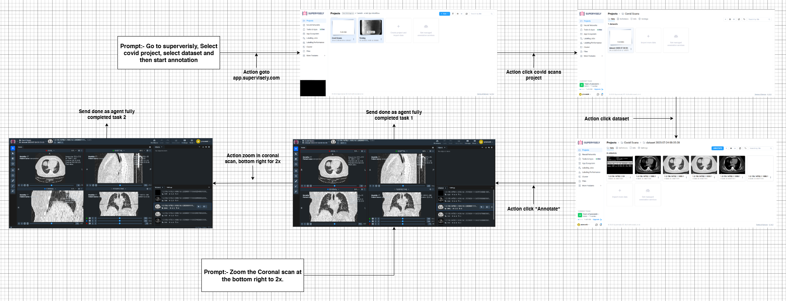
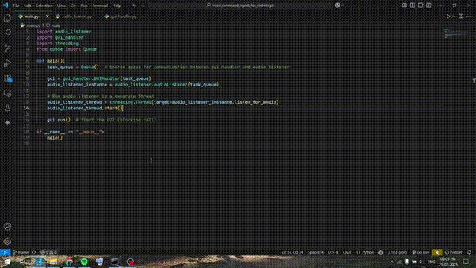

# Radiology-Website-Automation-via-Natural-Language-for-Radiologists
## 🚀 Overview

This project is a voice-controlled automation system designed specifically for radiologists and researchers using the Supervisely website. It leverages two core components:

1. **Push2Type** ([EnviralDesign/Push2Type](https://github.com/EnviralDesign/Push2Type.git)) for voice input and natural language processing.  
2. **Browser Automation using LLM** ([Praveen’s Project](https://github.com/praveenkurup/Browser-Automation-Using-LLM.git)) for controlling, navigating, and interacting with the website.

The system allows radiologists to perform tasks on the Supervisely platform hands-free using natural language commands, enhancing efficiency and accessibility in medical workflows.

## 🛠️ Technologies Used

- **Python**: 3.12.6
- **Selenium**: Browser automation
- **openai**: OpenAI API integration
- **BeautifulSoup 4**: HTML parsing
- **html_to_json**: Structured DOM representation
- **keyboard**: Keyboard interaction emulation
- **Push2Type**: Voice input and command translation

Configuration and dependencies are similar to the Browser Automation using LLM project.

## 📸 Screenshots & Media
### Workflow Chart
- 
### Usage Video
-  <!-- Placeholder for usage video -->

## ⚙️ Installation

### Prerequisites

- Python 3.12.6 installed
- Browser drivers required by Selenium (like ChromeDriver or geckodriver)

### Steps

1. Clone this repository:
   ```bash
   git clone https://github.com/username/Radiology-Website-Automation-via-Natural-Language-for-Radiologists.git
   ```
2. Navigate into the project directory:
   ```bash
   cd Radiology-Website-Automation-via-Natural-Language-for-Radiologists
   ```
3. Clone Push2Type inside this project:
   ```bash
   git clone https://github.com/EnviralDesign/Push2Type.git
   ```
4. Install dependencies:
   ```bash
   pip install -r requirements.txt
   ```
5. Run the project:
   ```bash
   python main.py
   ```

## 🧪 Usage

After running the application, radiologists can interact with the Supervisely website using natural language voice commands. The system interprets commands via Push2Type and executes actions through the Browser Automation using LLM engine. Users can:

- Perform navigation and actions hands-free
- Control workflows on Supervisely efficiently
- Monitor command history and errors dynamically

## 🧑‍🤝‍🧑 Contributing

Contributions are welcome! This project is designed as a foundation that can be extended or adapted for other medical or research websites. Feel free to fork the repository, improve functionality, and submit pull requests. Please open issues if you encounter bugs or have suggestions.

## 📄 License

This project is licensed under the MIT License - see the [LICENSE](./LICENSE) file for details.

## 📬 Contact

For questions or feedback, reach out via email: [username.praveen.email@gmail.com](mailto:username.praveen.email@gmail.com)
